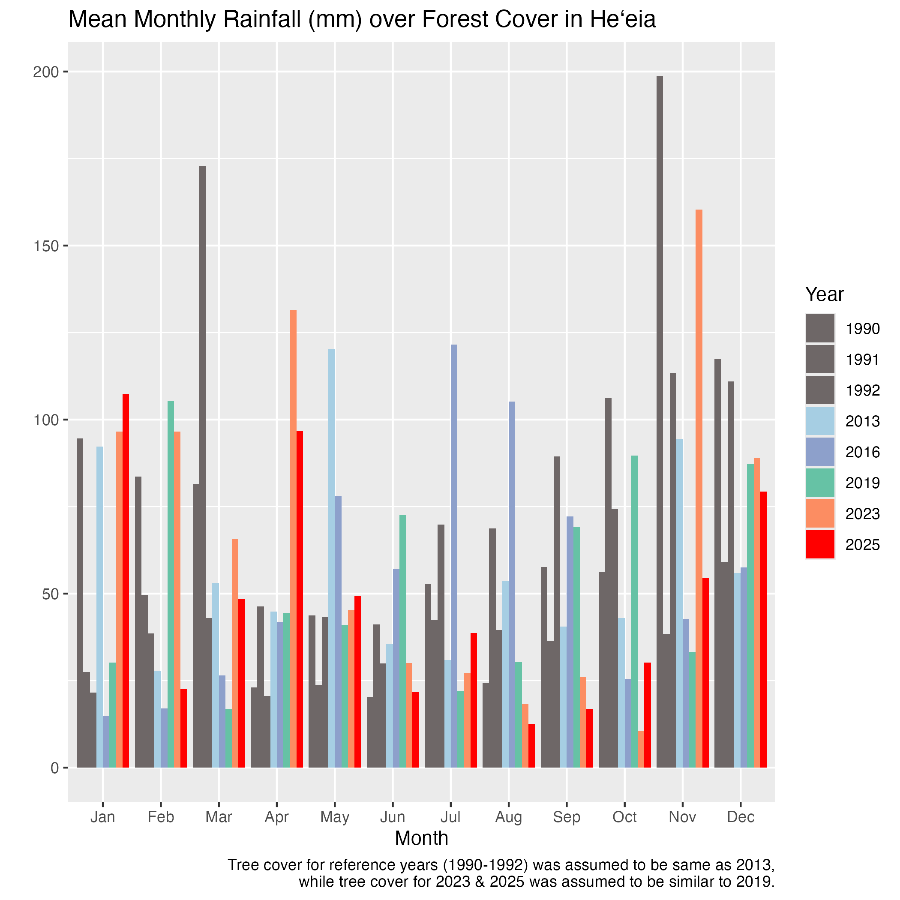
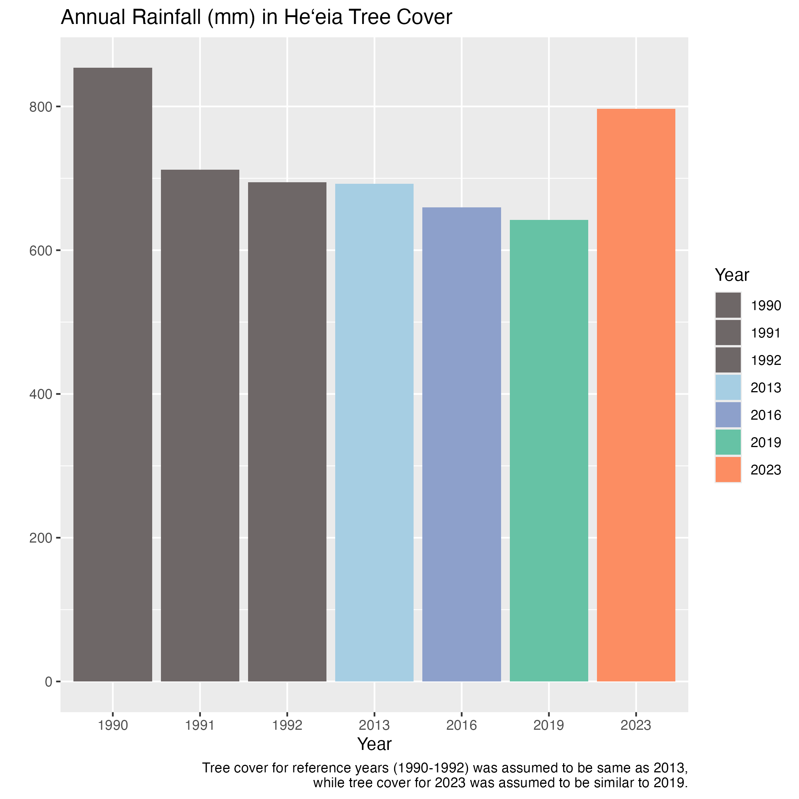

## Attention

-   This is intended as a guide only.

-   This is purely for Heʻeia NERR Staff members use only, please do not circulate.

-   Data is derived from Hawaiʻi Climate Data Portal, USGS, USDA, FWS, Stat of Hawaiʻi GIS Portal, and NOAA.

-   Questions? Reach out to Louis (louiscbc\@hawaii.edu)😉

Mahalo!

## Rainfall in Heʻeia Ahupuaʻa Forests

Recent years 2023, 2025 show very low rainfall from Aug to Oct.

Flashier rainfall mean less infiltration and groundwater recharge, as small/ medium storms produce relatively small amounts of runoff and disproportionately large amounts of infiltration.

## Annual averages for each year

Overall rainfall is falling in forested areas (good recharge areas). 
Note, 2023 is the only La Nina year. 